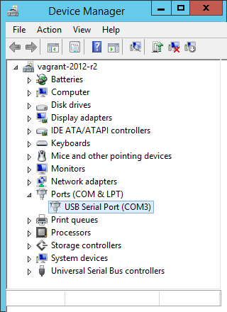
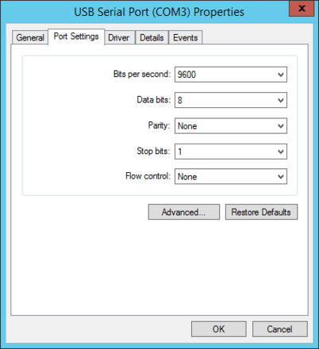
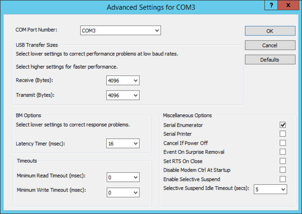


This example console application will use [TestStack.White](https://github.com/TestStack/White) to play with the Windows Device Manager. It will:

* Launch a new instance of the Device Manager.
* Right-click the `Ports (COM & LPT)` tree node.
* Find the first `COM` device node, like the `USB Serial Port (COM3)`.
* Open the device node context-menu and click `Properties`.
* Switch to the `Port Settings` tab.
* Click the `Advanced...` button.
* Click randomly on combo and check boxes.

I'm testing this application with [these FTDI devices](http://www.aliexpress.com/wholesale?SearchText=usb+serial+ftdi).

There's a simpler example of TestStack.White at the [Automate Notepad repo](https://github.com/rgl/AutomateNotepad).

# vagrant

This repo includes a [Vagrantfile](Vagrantfile), which redirects your FTDI device to the VM.

You first need to build the base `windows_2012_r2` image. You can read more about this at my [Using Packer, Vagrant and Boxstarter to create Windows environments](http://blog.ruilopes.com/using-packer-vagrant-and-boxstarter-to-create-windows-environments.html) post.

After you have the base image, you can use this Vagrant environment:

* Use Visual Studio to build the solution (on your Host machine).
* If your USB device is not from FTDI see the `Vagrantfile` for ways to redirect the device to the VM.
* Run `vagrant up`.
* Inside the Guest VM open a PowerShell window.
* `cd` into `C:\vagrant\bin\Debug`.
* Run `.\AutomateDeviceManagerPoC.exe`.

# screenshots

The application interacts with these screens.

